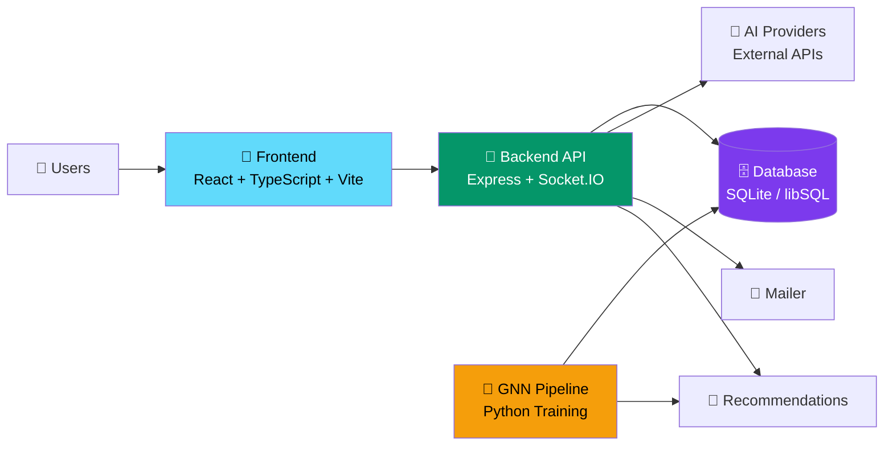

<div align="center">

# **SpiritHub**

<div style="margin: 20px 0;">
  
</div>

### 🚀 An AI-native community platform for collaboration, creator tooling, and recommendation-driven growth

---

<table>
  <tr align="center">
    <td><b>📚 <a href="#overview">Overview</a></b></td>
    <td><b>🛠️ <a href="#quick-start">Quick Start</a></b></td>
    <td><b>📖 <a href="#architecture">Architecture</a></b></td>
    <td><b>📋 <a href="./LICENSE">License</a></b></td>
    <td><b>🔐 <a href="#security-posture">Security</a></b></td>
  </tr>
</table>

---

[](.)
[](./frontend)
[](./gnn)
[](.)
[](./LICENSE)

---

**SpiritHub** is a full-stack product workspace that combines a social community, collaborative workspaces, AI utility tools, and a recommendation engine in one repository. Built as a single operational surface for content publishing, realtime interaction, culture-aware AI tooling, and graph-based personalization.

## 📋 Overview

Most product repos stop at either "community" or "tooling". **SpiritHub** intentionally merges both:

| Feature | Description |
|---------|-------------|
| **Community** | Posts, comments, friends, notifications, rankings, profiles |
| **Collaboration** | CoLab projects and science-group style collaboration flows |
| **AI Tooling** | Chat assistant, copywriting, risk detection, domain-specific workflows |
| **Recommendations** | Graph-based training pipeline with personalized suggestions |
| **Operations** | Frontend build, backend service, deployment scripts, CI/CD ready |

## 🎯 Product Surface

| Domain | Coverage |
|--------|----------|
| **Community** | Feed, post detail, friends, leaderboard, notifications, profile |
| **Collaboration** | CoLab, science groups, rooms, events, shared project flows |
| **AI Toolkit** | Copywriting, content detection, logistics and profit-oriented tools |
| **Account System** | Registration, login, password reset, credits ledger, recharge |
| **Operations** | Deploy scripts, rollback scripts, nginx template, PM2 template |
| **Recommendation** | Training scripts, synthetic data generation, cleanup, upload pipeline |

## 🏗️ Architecture



## 📁 Repository Structure

```
lingjing-platform/
├─ frontend/              React app, routing, UI, pages, client API layer
├─ backend/              Express routes, auth, points, realtime, AI integrations
├─ gnn/                  Training scripts, synthetic data generation, recommendation jobs
├─ .github/workflows/    CI/CD pipeline configuration
├─ LICENSE               Apache 2.0 license
├─ deploy.sh             End-to-end deployment bootstrap template
├─ backup.sh             Database backup template
├─ nginx-lingjing.conf   Reverse proxy configuration
└─ README.md             Project documentation
```

## 🔧 Workspace Breakdown

### 📱 frontend/

The web application is built with React 18, TypeScript, Vite, and Tailwind CSS. It includes routes for:

- **Auth**: login, register, forgot-password, reset-password
- **Community**: feed, post detail, friends, leaderboard, ledger, profile
- **Collaboration**: CoLab and science-group pages
- **AI Tools**: copywriting, content detection, logistics workflows
- **Legal**: service, privacy, and terms pages

### 🔌 backend/

The service layer exposes modular route groups for:

- **Authentication**: user sessions, JWT management, OAuth flows
- **Social**: posts, friends, notifications, points, recommendations
- **Collaboration**: CoLab, rooms, events, science features
- **AI Services**: chat, copywriter, and content detection endpoints
- **Realtime**: Socket.IO messaging and live updates

All routes are compiled from TypeScript with runtime data sync for schemas.

### 🧠 gnn/

The recommendation pipeline contains:

- **Dataset Generation**: synthetic data for training
- **Utilities**: data cleanup and preprocessing
- **Training**: local GNN workflow for recommendation models
- **Integration**: recommendation upload and refresh helpers

This keeps graph-based recommendation logic isolated from the request-serving path while living in the same monorepo.

## 🚀 Quick Start

### Prerequisites

```bash
Node.js 18+    | npm 9+    | Python 3.10+
```

### Installation

Install all dependencies:

```bash
npm run install:all
```

### Development

Run frontend + backend together:

```bash
npm run dev
```

**Run individually:**

```bash
# Frontend
cd frontend && npm run dev

# Backend
cd backend && npm run dev

# GNN utilities
cd gnn && python run_local.py --help
```

## ⚙️ Environment Configuration

This repository **does not track `.env` files**. Provide sensitive runtime values through environment variables only.

**Minimum backend requirements:**

```env
JWT_SECRET=your-secret-key
DASHSCOPE_API_KEY=your-api-key
```

Additional variables may be required depending on your deployment target (mail, domain, infrastructure paths, etc.).

## 📜 Available Commands

| Command | Purpose |
|---------|---------|
| `npm run install:all` | Install backend and frontend dependencies |
| `npm run dev` | Run backend and frontend concurrently |
| `npm run build` | Build frontend first, then backend |
| `npm run start` | Launch compiled backend service |

## 🚢 Deployment & Operations

This repository includes production-oriented operational templates:

| File | Purpose |
|------|---------|
| `.github/workflows/ci-cd.yml` | Automated build, test, and deploy pipeline |
| `deploy.sh` | Bootstrap and deployment script template |
| `backup.sh` | Database backup and recovery template |
| `nginx-lingjing.conf` | Reverse proxy configuration |
| `ecosystem.config.js` | PM2 process management template |

> **Note:** These files are intentionally sanitized for public use and employ placeholder values where infrastructure-specific details would normally exist.

## 🔐 Security Posture

- ✅ No production `.env` files are tracked in version control
- ✅ All sensitive credentials loaded from environment variables only
- ✅ Public repository content uses safe placeholders instead of real endpoints
- ✅ `.gitignore` prevents accidental credential commits
- ✅ Regular security audits and dependency scans

See [LICENSE](./LICENSE) for Apache-2.0 terms and [CONTRIBUTING.md](#) for guidelines.

## 📚 Tech Stack

| Layer | Technologies |
|-------|--------------|
| **Frontend** | React 18, TypeScript 5, Vite, Tailwind CSS, Axios, Sentry |
| **Backend** | Node.js 18+, Express, TypeScript, Socket.IO, JWT, Nodemailer |
| **Database** | SQLite / libSQL with schema-driven storage |
| **AI / ML** | OpenAI-compatible client APIs, GNN training pipeline (Python) |
| **DevOps** | GitHub Actions, PM2, Nginx, Docker-ready structure |

## 💡 Development Notes

- Build artifacts and local secret files are excluded from version control
- Operational templates are examples, not environment-specific production truth
- The repository is structured to keep product code, deployment flow, and recommendation jobs together without mixing runtime secrets into source control

---

## 📄 License

**Apache-2.0** – See [LICENSE](./LICENSE) for full details.

This project is open source and available under the Apache License 2.0. You are free to use, modify, and distribute this software under the terms of the license.
