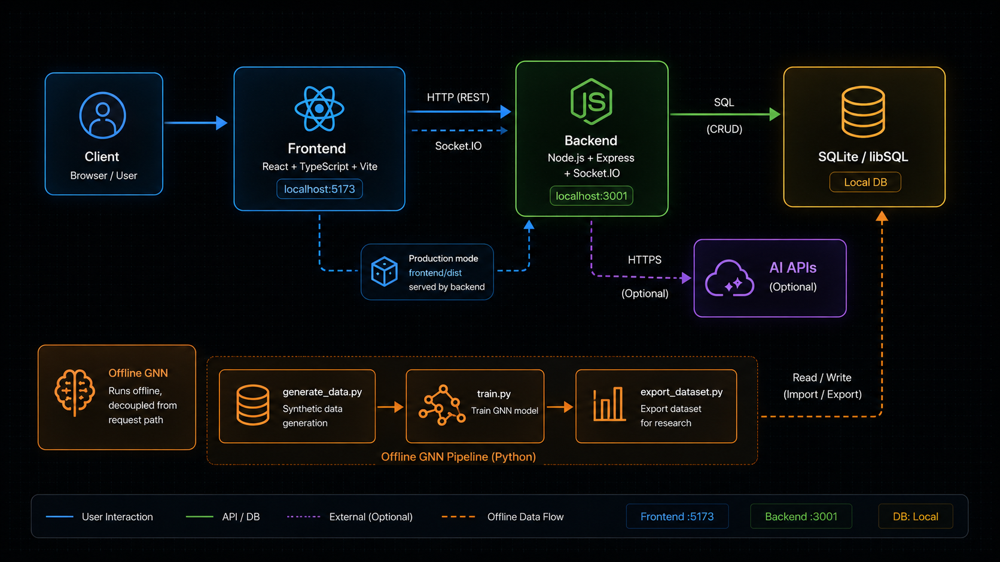

<div align="center">
  <br />
  
  <br /><br />

  <p>
    <strong>AI-native community platform for collaboration, creator tooling, and graph-based personalization.</strong>
  </p>

  <p>
    <a href="#-overview">Overview</a> ·
    <a href="#-repository-structure">Structure</a> ·
    <a href="#-architecture">Architecture</a> ·
    <a href="#-one-click-local-setup">One-Click Setup</a> ·
    <a href="#%EF%B8%8F-configuration">Configuration</a> ·
    <a href="#-gnn-tools">GNN Tools</a> ·
    <a href="#-license">License</a>
  </p>

  <p>
    
    
    
    
    
  </p>
</div>

---

## Overview

SpiritHub is a reproducible full-stack monorepo that combines a social community platform, AI-powered creator tooling, and a graph neural network recommendation pipeline in one codebase.

This repository is local-first: people browsing the code should be able to run frontend and backend on their own machine with minimal setup.

| Layer | What it does |
|---|---|
| **Community** | Feed, posts, comments, friends, leaderboard, profiles, notifications |
| **Collaboration** | CoLab projects, science groups, rooms, shared events |
| **AI Toolkit** | Chat assistant, copywriting, content risk detection, domain workflows |
| **Recommendations** | GNN training, dataset export, and synthetic data generation |
| **Build** | Frontend + backend workspace scripts for local development and production builds |

---

## Repository Structure

```
spirithub/
├── frontend/               # React 18 + TypeScript + Vite app
│   ├── src/                # Pages, components, hooks, lib, styles
│   └── public/             # Static assets, including logo.png
├── backend/                # Express + Socket.IO API service
│   └── src/                # Routes, DB access, auth, realtime, services
├── gnn/                    # Recommendation and dataset tooling
│   ├── train.py            # GNN training entry point
│   ├── run_local.py        # Download/train/upload helper for local use
│   ├── generate_data.py    # Synthetic data generator for training
│   ├── export_dataset.py   # Production DB export for research datasets
│   ├── cleanup.py          # GNN data cleanup utility
│   ├── requirements.txt    # Python dependencies for GNN tooling
│   ├── train_temp.db       # Temporary training database
│   └── weights/            # Saved model weights
├── data/                   # Shared runtime data directory
├── LICENSE                 # Apache-2.0 license
├── package.json            # Root workspace scripts
└── README.md               # This document
```

---

## Architecture

<div align="center">
  
</div>

The frontend communicates with the backend over HTTP REST and Socket.IO. In production, the backend serves the built frontend assets directly, while the GNN pipeline runs as a separate Python workflow that reads and writes shared data files.

---

## One-Click Local Setup

For people cloning this repository, the fastest path is a single command:

```bash
npm run setup
```

What this command does:

- installs root dependencies, including the CLI runner used by `npm run dev`
- installs frontend and backend dependencies
- guides you to fill local config (JWT secret, optional AI key, ports)
- creates `backend/.env` automatically
- optionally starts frontend and backend immediately

For non-interactive defaults:

```bash
npm run setup:quick
```

---

## Quick Start (Manual)

### Prerequisites

| Tool | Version |
|---|---|
| Node.js | 18+ |
| npm | 9+ |
| Python | 3.10+ |

### Install

```bash
# Install all workspace dependencies in one step
npm run install:all
```

This installs the root workspace first, then backend and frontend, so the root `concurrently` runner is available for `npm run dev`.

### Configure Backend Environment

```bash
# Linux / macOS
cp backend/.env.example backend/.env

# Windows PowerShell
Copy-Item backend/.env.example backend/.env
```

You can keep most defaults for local development. The application can start without production secrets.

### Development

```bash
# Start frontend + backend concurrently
npm run dev
```

Or run each service independently:

```bash
# Frontend — http://localhost:5173
cd frontend && npm run dev

# Backend — http://localhost:3001
cd backend && npm run dev

# GNN utilities
cd gnn && python export_dataset.py --help
```

---

## Configuration

No `.env` files are tracked. All runtime values must be provided as environment variables.

**Local development (backend):**

```env
PORT=3001
JWT_SECRET=lingjing_secret_dev
FRONTEND_URL=http://localhost:5173
```

**Optional for AI features:**

```env
DASHSCOPE_API_KEY=
```

When `DASHSCOPE_API_KEY` is missing, AI-related endpoints may not work, but frontend + backend local startup still works.

---

## Scripts

| Command | Description |
|---|---|
| `npm run setup` | Interactive one-click local setup (deps + env + optional start) |
| `npm run setup:quick` | Non-interactive local setup with defaults |
| `npm run install:all` | Install dependencies for all workspaces |
| `npm run dev` | Start frontend and backend in watch mode |
| `npm run build` | Build frontend assets, then compile backend |
| `npm run start` | Launch backend in compiled mode (serves frontend dist in production) |

---

## GNN Tools

The `gnn/` directory is intentionally separate from the frontend and backend source trees because it contains offline recommendation tooling rather than request-serving code.

Common entry points:

- `python train.py` trains the recommendation model
- `python generate_data.py` produces synthetic training data in `train_temp.db`
- `python export_dataset.py` exports research datasets from the shared database
- `python run_local.py` runs the download/train/upload helper flow for local experiments
- `python cleanup.py` performs GNN dataset maintenance tasks

The root package workflow for local verification is:

```bash
npm run install:all
npm run build
NODE_ENV=production JWT_SECRET=your-secret DASHSCOPE_API_KEY=your-key npm run start
```

This sequence installs dependencies, builds frontend/backend, and starts a single backend process that serves compiled frontend assets.

---

## Tech Stack

| Layer | Technologies |
|---|---|
| Frontend | React 18, TypeScript 5, Vite, Tailwind CSS, Axios, Sentry |
| Backend | Node.js 18+, Express, TypeScript, Socket.IO, JWT, Nodemailer |
| Database | SQLite / libSQL |
| AI / ML | OpenAI-compatible APIs, Python GNN pipeline |
| Build System | npm workspaces, TypeScript, Vite, concurrently |

---

## Security

- `.env` files and secrets are excluded from version control via `.gitignore`
- All credentials are loaded exclusively from environment variables at runtime
- Public-facing templates use sanitized placeholder values
- The repository keeps deployment logic out of version control and relies on reproducible build steps instead

---

## Contributing

Contributions, issues, and feature requests are welcome. Please open an issue before submitting a pull request for significant changes.

---

## License

Apache 2.0 — see [LICENSE](./LICENSE) for details.
