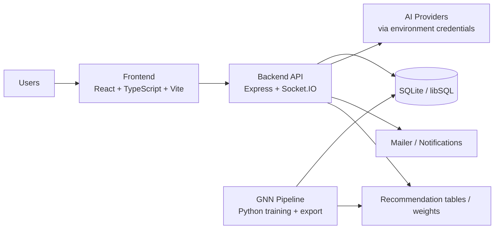

<div align="center">

# SpiritHub

### An AI-native community platform for collaboration, creator tooling, and recommendation-driven growth

[](./)
[](./frontend)
[](./backend)
[](./gnn)

</div>

---

SpiritHub is a full-stack product workspace that combines a social community, collaborative workspaces, AI utility tools, and a recommendation engine in one repository. It is designed as a single operational surface for content publishing, realtime interaction, culture-aware AI tooling, and graph-based personalization.

## Why This Repo Exists

Most product repos stop at either “community” or “tooling”. SpiritHub intentionally merges both:

- Community interaction: posts, comments, friends, notifications, rankings, profiles
- Collaborative workspaces: CoLab projects and science-group style collaboration flows
- AI feature layer: chat assistant, copywriting, risk detection, and domain-specific workflows
- Recommendation layer: graph training and recommendation data refresh pipeline
- Production path: frontend build, backend service, deployment scripts, rollback flow, CI-ready structure

## Product Surface

| Surface | What it covers |
| --- | --- |
| Community | feed, post detail, friends, leaderboard, notifications, profile |
| Collaboration | CoLab, science groups, rooms, events, shared project flows |
| AI Toolkit | copywriting, content detection, logistics and profit-oriented tools |
| Account System | registration, login, password reset, credits ledger, recharge |
| Operations | deploy scripts, rollback scripts, nginx template, PM2 template |
| Recommendation | training scripts, synthetic data generation, cleanup, upload pipeline |

## Architecture



## Repository Map

```text
lingjing-platform/
├─ frontend/   React app, routing, UI, pages, client API layer
├─ backend/    Express routes, auth, points, realtime, AI integrations
├─ gnn/        training scripts, synthetic data generation, recommendation jobs
├─ deploy.sh   end-to-end deployment bootstrap template
├─ backup.sh   database backup template
└─ nginx-lingjing.conf
```

## Workspace Breakdown

### frontend/

The web application is built with React 18, TypeScript, Vite, and Tailwind CSS. It includes routes for:

- home, login, register, forgot-password, reset-password
- community, post detail, friends, leaderboard, ledger, profile
- CoLab and science-group collaboration pages
- AI tool pages such as copywriting and detection workflows
- service, privacy, and terms pages for the public product surface

### backend/

The service layer exposes modular route groups for:

- auth and users
- posts, friends, notifications, points, recommendations
- CoLab, rooms, events, and science features
- AI chat, copywriter, and detection endpoints
- realtime messaging over Socket.IO

The backend is compiled from TypeScript and ships with runtime data copy steps for schema and knowledge files.

### gnn/

The recommendation pipeline contains:

- synthetic dataset generation
- cleanup utilities
- local training workflow
- recommendation upload / refresh helpers

This keeps graph-based recommendation logic isolated from the request-serving path while still living in the same monorepo.

## Quick Start

### Prerequisites

- Node.js 18+
- npm 9+
- Python 3.10+

### Install All JavaScript Dependencies

```bash
npm run install:all
```

### Run Frontend + Backend Together

```bash
npm run dev
```

### Run Individually

Frontend:

```bash
cd frontend
npm install
npm run dev
```

Backend:

```bash
cd backend
npm install
npm run dev
```

GNN utilities:

```bash
cd gnn
python run_local.py --help
```

## Required Runtime Configuration

This repository does not track `.env` files.

Provide sensitive runtime values through environment variables only. The minimum backend requirements are:

- `JWT_SECRET`
- `DASHSCOPE_API_KEY`

Depending on your deployment target, you may also need mail, domain, and deployment-related variables.

## Root Scripts

| Command | Purpose |
| --- | --- |
| `npm run install:all` | install backend and frontend dependencies |
| `npm run dev` | run backend and frontend concurrently |
| `npm run build` | build frontend first, then backend |
| `npm run start` | launch compiled backend service |

## Delivery and Operations

The repo already contains production-oriented operational templates:

- frontend CI/CD workflow
- manual deploy and rollback scripts
- PM2 process template
- nginx reverse proxy template
- backup script template

These files are intentionally sanitized for public sharing and use placeholder values where infrastructure-specific details would normally exist.

## Security Posture

- No production `.env` files are tracked
- Public repository content uses placeholders instead of real endpoints and identities
- Secrets are expected from runtime environment injection only
- Repository ignore rules block credential-like local files from accidental commit

## Tech Stack

| Layer | Stack |
| --- | --- |
| Frontend | React, TypeScript, Vite, Tailwind CSS, Axios, Sentry |
| Backend | Node.js, Express, TypeScript, Socket.IO, JWT, Nodemailer |
| Data | SQLite / libSQL schema-driven storage |
| AI | OpenAI-compatible client wiring for external model APIs |
| ML / Recommendation | Python scripts for graph-based recommendation workflows |

## Development Notes

- Build artifacts and local secret files are intentionally excluded from version control
- Operational templates are examples, not environment-specific production truth
- The repository is structured to keep product code, deployment flow, and recommendation jobs in one place without mixing runtime secrets into source control

## License

MIT
